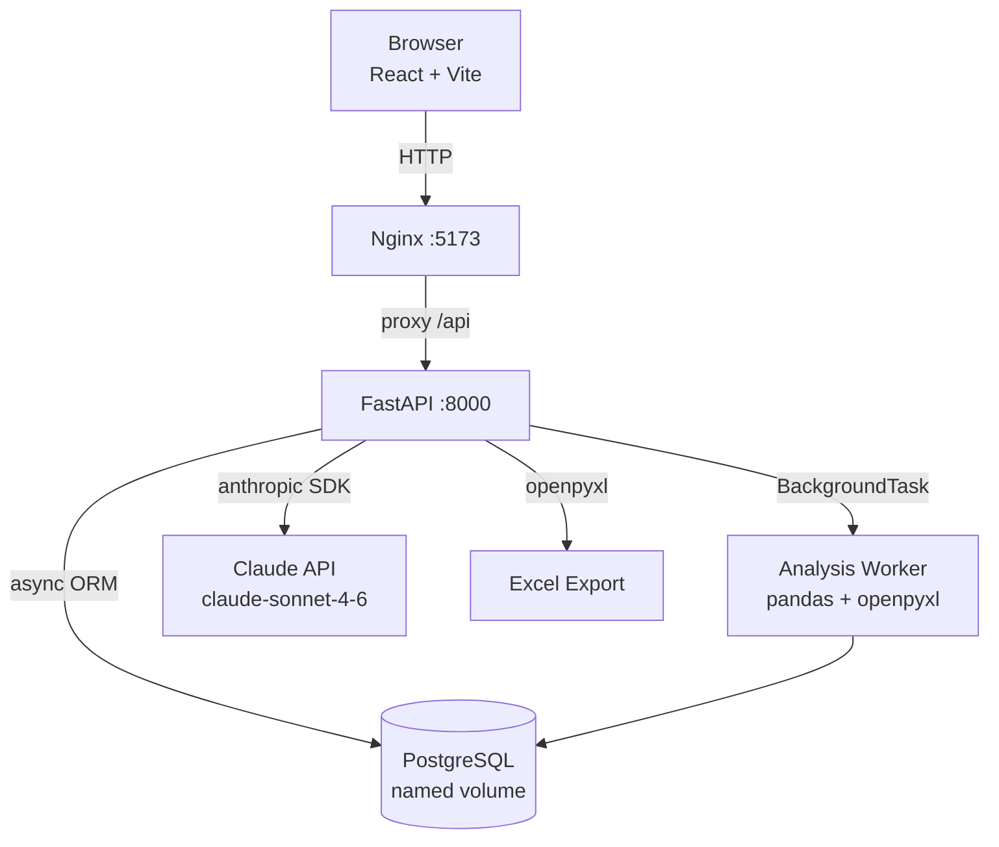

# WB Margin Analyzer

> **AI-powered margin analyzer for WB sellers. Upload cost+sales Excel → margin analysis + Claude AI interpretation.**

Инструмент для продавцов Wildberries: загружаете два Excel-файла (закупки + продажи) — получаете цветную таблицу маржинальности, AI-интерпретацию от Claude и Excel-отчёт за один клик.


---

## Quickstart

```bash
git clone https://github.com/your-username/wb-margin-analyzer.git
cd wb-margin-analyzer
cp .env.example .env          # add your SECRET_KEY and ANTHROPIC_API_KEY
docker compose up --build
```

- Frontend → **http://localhost:5173**
- API Docs → **http://localhost:8000/docs**

> `ANTHROPIC_API_KEY` is optional — the app starts without it, AI endpoints return `503` with a clear message.

---

## Architecture



**Request flow:**
1. User uploads two `.xlsx` files → FastAPI validates columns/format → returns `analysis_id`
2. Background worker parses files, calculates margin, writes results to DB
3. Frontend polls `GET /analyses/{id}` every 2 s until `status: done`
4. User requests AI interpretation → Claude generates Диагноз / Рекомендации / Риски
5. Follow-up chat uses a sliding window of the last 5 messages as context

---

## Features

| Feature | Details |
|---|---|
| **Async processing** | Analysis runs in a FastAPI `BackgroundTask` — upload returns `202` instantly, frontend polls for completion |
| **What If simulator** | Client-side price/cost sliders recalculate margin in real time — zero extra API calls |
| **Claude AI chat** | `POST /analyses/{id}/interpret` → 3-section report; `POST /analyses/{id}/chat` → stateful Q&A with last-5-message context window |
| **JWT auth** | Register/login, Bearer token, `401` on expiry redirects to login page |
| **Color-coded Excel export** | `GET /analyses/{id}/export` → `.xlsx` with green/yellow/red rows + AI interpretation on Sheet 2 |
| **pytest coverage** | 60 tests across all layers (validator, analytics engine, all API endpoints) |

---

## Tech Stack

### Backend
- **FastAPI** (async) + **SQLAlchemy 2.0** async ORM
- **Alembic** migrations (run automatically on container start)
- **pandas** for Excel parsing and margin calculations
- **openpyxl** for file validation and Excel export
- **anthropic** Python SDK (`AsyncAnthropic`, `claude-sonnet-4-6`)
- **python-jose** + **bcrypt** for JWT auth

### Frontend
- **React 18** + **TypeScript** + **Vite**
- **Tailwind CSS v3** for styling
- **React Router v6** for SPA routing
- **Axios** with interceptors (auto-attach Bearer token, redirect on 401)

### Infrastructure
- **PostgreSQL 16** with named volume
- **Docker Compose** — one-command startup
- **Nginx** — serves built React SPA, proxies `/api` to FastAPI

---

## API Overview

| Method | Endpoint | Description |
|--------|----------|-------------|
| `POST` | `/api/v1/auth/register` | Register new user |
| `POST` | `/api/v1/auth/login` | Login, get JWT |
| `POST` | `/api/v1/uploads/validate-purchases` | Validate purchases file |
| `POST` | `/api/v1/uploads/validate-sales` | Validate sales file |
| `POST` | `/api/v1/analyses` | Create analysis (async, 202) |
| `GET` | `/api/v1/analyses/{id}` | Poll status + results |
| `GET` | `/api/v1/analyses` | History list |
| `POST` | `/api/v1/analyses/{id}/interpret` | Generate AI interpretation |
| `POST` | `/api/v1/analyses/{id}/chat` | Follow-up Q&A with Claude |
| `GET` | `/api/v1/analyses/{id}/export` | Download `.xlsx` report |

Full interactive docs: **http://localhost:8000/docs**

---

## Domain Note — Return Logistics Formula

Return logistics is calculated as `1.5 × base_logistics` per returned unit (Wildberries charges a higher rate for returns). The purchase cost uses `(sold - returns)` units, not `sold`:

```python
purchase_cost = purchase_price * (sold - returns)  # ✓ correct
# purchase_cost = purchase_price * sold             # ✗ overstates cost
```

This matches WB's actual payout structure and avoids inflating the cost basis for products with high return rates.

---

## Local Development (without Docker)

```bash
# Backend
python -m venv .venv && source .venv/bin/activate   # Windows: .venv\Scripts\activate
pip install -r requirements.txt -r requirements-dev.txt
cp .env.example .env   # set DATABASE_URL to your local PostgreSQL
alembic upgrade head
uvicorn backend.main:app --reload

# Frontend
cd frontend
npm install
npm run dev
```

Run tests:

```bash
pytest -v   # 60 tests
```

---

## Environment Variables

| Variable | Required | Description |
|----------|----------|-------------|
| `DATABASE_URL` | ✅ | PostgreSQL async URL (`postgresql+asyncpg://...`) |
| `SECRET_KEY` | ✅ | JWT signing secret (`openssl rand -hex 32`) |
| `ANTHROPIC_API_KEY` | ☑ optional | Claude API key — app runs without it, AI returns 503 |
| `CORS_ORIGINS` | ☑ optional | JSON list of allowed origins (default: `["http://localhost:5173"]`) |

---

## Project Structure

```
wb-margin-analyzer/
├── backend/
│   ├── api/v1/          # FastAPI routers (auth, uploads, analyses)
│   ├── core/            # Config (pydantic-settings)
│   ├── models/          # SQLAlchemy models
│   ├── schemas/         # Pydantic request/response schemas
│   └── services/        # Business logic (analysis, AI, export, validator)
├── frontend/
│   └── src/
│       ├── api/         # Axios client + typed API functions
│       ├── components/  # FileDropzone, MarginTable, WhatIfPanel, ChatBlock
│       ├── context/     # AuthContext (JWT)
│       └── pages/       # Login, Register, Upload, Dashboard, History
├── tests/               # pytest — 60 tests
├── alembic/             # DB migrations
├── docker-compose.yml
└── .env.example
```
